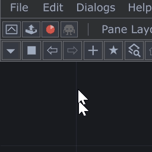

# twozero TD MCP

MCP server for TouchDesigner, running inside the [twozero plugin](https://www.404zero.com/twozero).

## Requirements

- TouchDesigner `2025.32280+`
- twozero plugin installed in TD
- For best TD results: use `Claude 4.6+` or `GPT-5.3+`

## Quickstart

1. Drop `twozero.tox` into TouchDesigner: [https://www.404zero.com/pisang/twozero.tox](https://www.404zero.com/pisang/twozero.tox) -> Install
2. Turn on MCP in twozero settings.



3. Prompt your agent (Cursor/Codex/Claude):
   - `Add twozero TD MCP for me with server key "twozero_td" and URL "http://localhost:40404/mcp". Configure it globally (user scope) so it is available from any project/workspace.`
4. Or manually:

## Cursor

Add to `~/.cursor/mcp.json`:

```json
{
  "mcpServers": {
    "twozero_td": {
      "url": "http://localhost:40404/mcp"
    }
  }
}
```

Reload Cursor window.

## Codex

Add to `~/.codex/config.toml`:

```toml
[mcp_servers.twozero_td]
url = "http://127.0.0.1:40404/mcp"
```

Restart Codex app/session.

## Claude Code

```bash
claude mcp add --transport http --scope user twozero_td http://localhost:40404/mcp
```

Check:

```bash
claude mcp list
```

## Notes

- Base port is controlled by twozero setting `MCP default port`.
- Multi-instance TD behavior is automatic: configure only one MCP URL in your client (`http://localhost:<MCP default port>/mcp`). Do not add separate client entries for each TD instance; twozero handles additional instance ports internally.

## Usage Principles

- Start each new chat with a prompt like:
  - `Show me what you can see in my TD project.`
  - `Check in TD: [your prompt]`
  - `Here in TD: [your prompt]`
  This makes the agent use MCP immediately and confirm it can see your current TD context (project, network, selected operator).
- After that, give tasks directly in normal language.
- When you say `here in TD`, it means the place/network you are currently looking at in TD.
- When you say `this operator in TD`, it means the operator you currently have selected.

## Task Prompts (after MCP is confirmed)

Use these prompts only after the agent already confirmed it sees your TouchDesigner context.

- Errors: `Check errors across the whole project and show what is critical first.`
- Performance: `Analyze what is causing lag and show the top slow operators.`
- Compare patches/containers: `Compare container A and B: structure, parameters, and connections; list the differences.`
- Work on selected operator: `Inspect this selected operator and nearby chain; do not change anything until I confirm.`
- Safe mode first: `Diagnostics and plan first, changes only after approval.`
- Verify after fixes: `After applying fixes, run error and performance checks again to verify.`

## Localization Equivalents

Use these equivalents when chatting in other languages:

### Russian

- `TouchDesigner` = `TD` = `тач`
- `project` = `patch` = `проект` = `патч` = `.toe file`
- `operator` = `op` = `оператор` = `оп`
- `parameter` = `par` = `параметр` = `пар`
- `here in TD` = `в таче вот тут`
- `this operator in TD` = `в таче вот этот оп`
- `Show me what you can see in my TD project.` = `Посмотри, что у меня в таче.`


